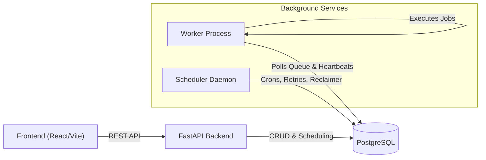

# Job Scheduler

A robust, distributed background job scheduler built with FastAPI, PostgreSQL, and React. It provides functionality similar to Sidekiq, Celery, BullMQ, or AWS SQS.

## Features

- **Authentication & RBAC**: JWT-based login, isolated projects by user organization.
- **Queue Management**: Priority levels, concurrency limits, and pausing/resuming queues.
- **Job Types**: Immediate, Delayed (Scheduled), Recurring (Cron), and Batch execution.
- **Reliable Worker Service**: Atomic job claiming (`SELECT FOR UPDATE SKIP LOCKED`) ensures a job is never processed twice.
- **Retry Strategies**: Fixed Delay, Linear Backoff, and Exponential Backoff.
- **Dead Letter Queue (DLQ)**: Permanently failed jobs are stored securely for later analysis and manual retry.
- **Resilience**: Workers send heartbeats. If a worker crashes, a Stale Job Reclaimer resets its jobs so they can be processed again.
- **Comprehensive UI**: Live throughput graphs, execution history, logs, and queue configuration.

## System Architecture


## Getting Started

### 1. Prerequisites
- Docker & Docker Compose (for PostgreSQL).
- Python 3.11+
- Node.js 18+

### 2. Start PostgreSQL
```bash
docker-compose up -d
```

### 3. Configure Environment Variables
```bash
cd backend
cp .env.example .env
# Edit .env and set your own POSTGRES_PASSWORD and SECRET_KEY
```

> **Important**: Never commit your `.env` file. It is listed in `.gitignore`.

### 4. Backend Setup
```bash
cd backend
python -m venv venv
source venv/bin/activate  # On Windows: venv\Scripts\activate
pip install -r requirements.txt

# Run migrations
alembic upgrade head

# Start API Server (Terminal 1)
uvicorn app.main:app --reload

# Start Scheduler Daemon (Terminal 2)
# Handles cron jobs, retries, and reclaiming jobs from dead workers
python app/scheduler/main.py
```

### 5. Worker Setup
The worker is a separate process that pulls jobs from the database and executes them.
```bash
cd worker
python main.py
```

### 5. Frontend Setup
```bash
cd frontend
npm install
npm run dev
```

## Documentation

For a detailed view of the architecture and database schema, see the `/docs` directory.
- [Architecture & Sequence Diagrams](docs/architecture.md)
- [Database ER Diagram](docs/database.md)

## Tradeoffs & Design Decisions
- **Database as a Message Broker**: We use PostgreSQL as the queue instead of Redis or RabbitMQ to simplify infrastructure and take advantage of ACID properties. The use of `SKIP LOCKED` ensures high concurrency without deadlocks, though it may not scale to tens of thousands of jobs per second like a dedicated message broker could.
- **Polling vs Push**: Workers poll the database for new jobs instead of receiving pushes. This is simpler to implement and naturally handles backpressure, but introduces a small delay (up to the polling interval).
- **Separation of Concerns**: The scheduler is separated from the API and worker. This allows scaling workers independently of the scheduler (which must be a singleton or use leader election in production).
