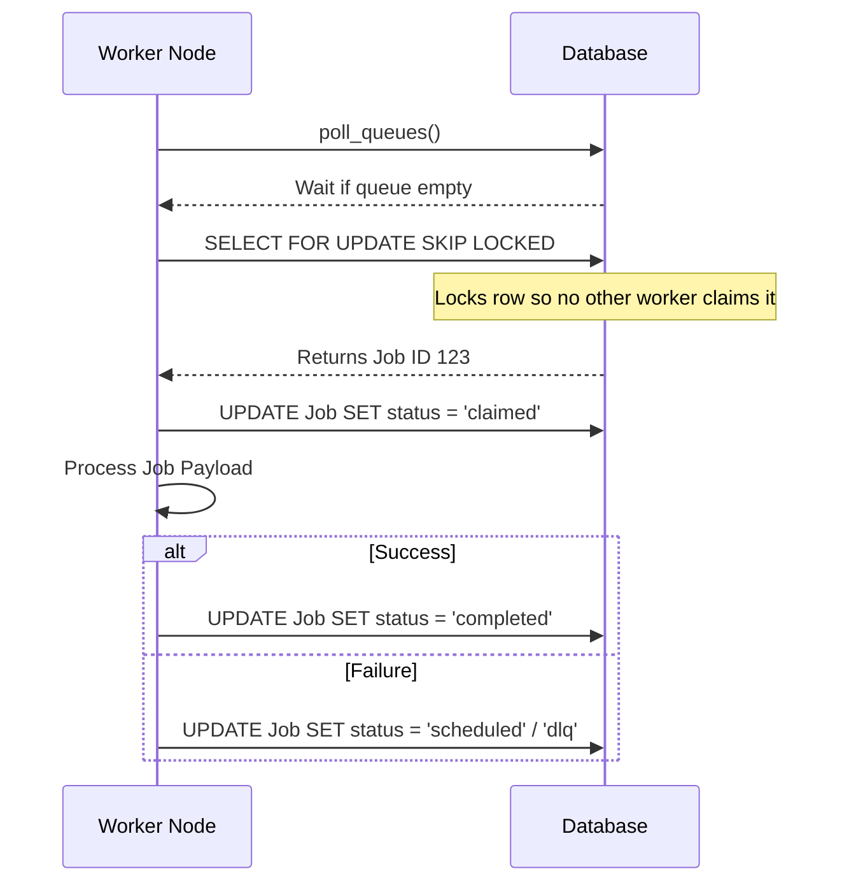
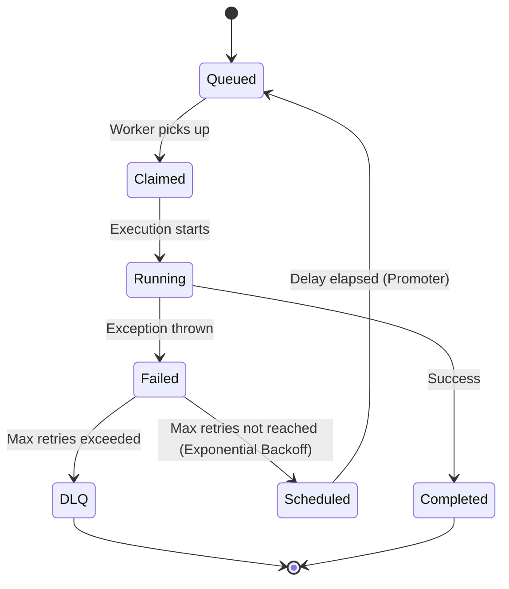

# Architecture

The Codity Job Scheduler uses a robust, scalable architecture separated into distinct logical components.

## High Level Architecture

```mermaid
graph TD
    UI[Frontend (React/Vite)] --> |REST API| API[FastAPI Backend]
    
    API --> |CRUD & Scheduling| DB[(PostgreSQL)]
    
    subgraph Background Services
        Worker[Worker Process] --> |Polls Queue| DB
        Worker --> |Executes Jobs| Worker
        Worker --> |Heartbeat| DB
        
        Scheduler[Scheduler Daemon] --> |Cron Jobs| DB
        Scheduler --> |Retry Promotion| DB
        Scheduler --> |Stale Job Reclaimer| DB
    end
```

## Atomic Claiming Sequence

To ensure reliability and prevent duplicate execution across multiple workers, we use `SELECT ... FOR UPDATE SKIP LOCKED`.



## Retry and DLQ Lifecycle


