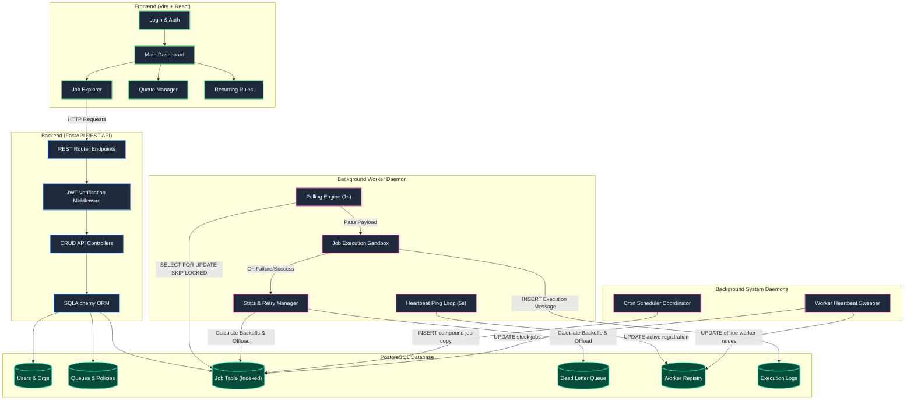
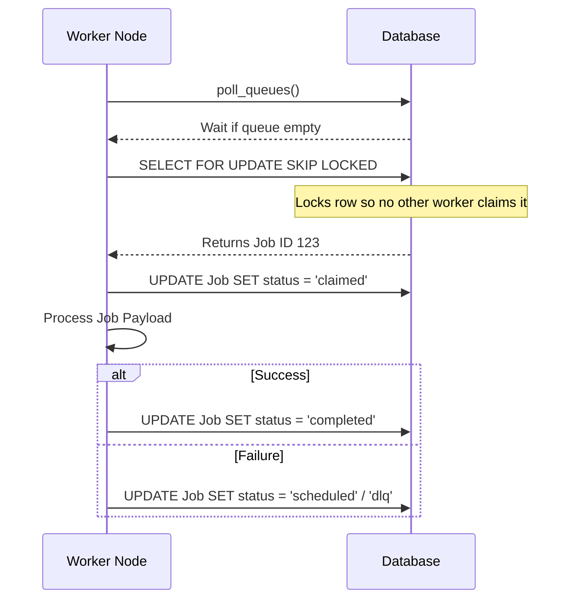
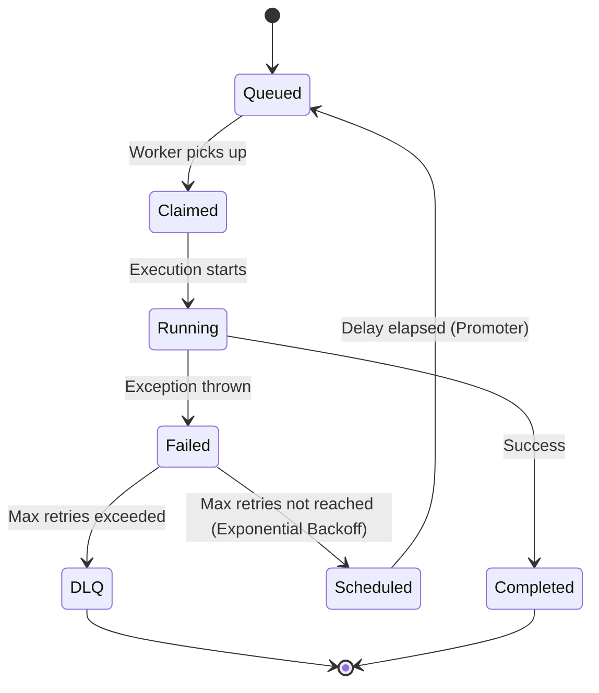

# Architecture

The Job Scheduler uses a robust, scalable architecture separated into distinct logical components.

## High Level Architecture

## Atomic Claiming Sequence

To ensure reliability and prevent duplicate execution across multiple workers, we use `SELECT ... FOR UPDATE SKIP LOCKED`.

## Retry and DLQ Lifecycle

