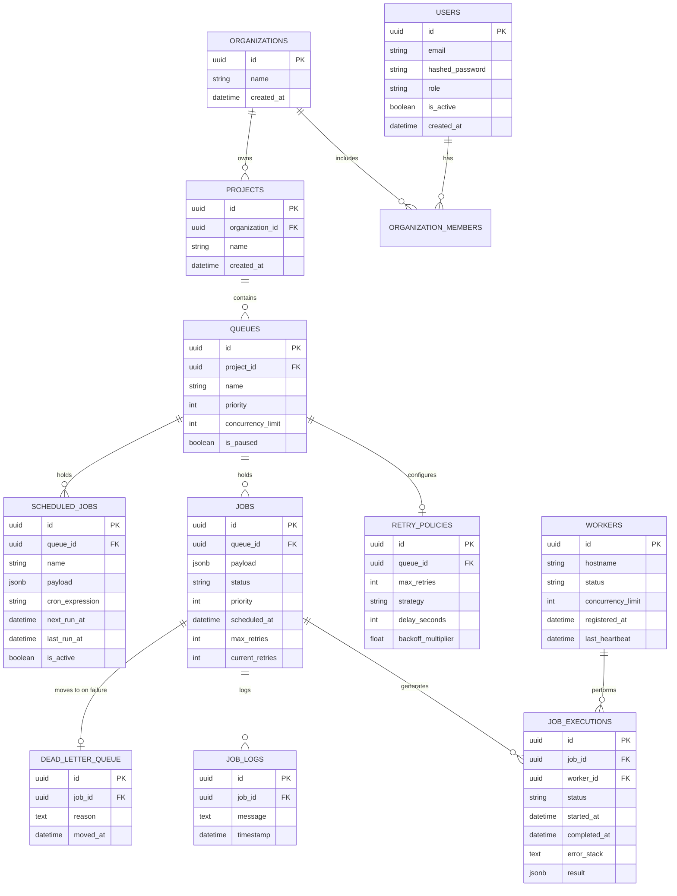

# Database ER Diagram

The following Mermaid diagram maps out the relationships between tables in the Codity PostgreSQL database.

```mermaid
erDiagram
    USERS ||--o{ ORGANIZATION_MEMBERS : "has"
    ORGANIZATIONS ||--o{ ORGANIZATION_MEMBERS : "includes"
    ORGANIZATIONS ||--o{ PROJECTS : "owns"
    
    PROJECTS ||--o{ QUEUES : "contains"
    
    QUEUES ||--o| RETRY_POLICIES : "configures"
    QUEUES ||--o{ JOBS : "holds"
    QUEUES ||--o{ SCHEDULED_JOBS : "holds"
    
    JOBS ||--o{ JOB_EXECUTIONS : "generates"
    JOBS ||--o{ JOB_LOGS : "logs"
    JOBS ||--o| DEAD_LETTER_QUEUE : "moves to on failure"
    
    WORKERS ||--o{ JOB_EXECUTIONS : "performs"

    USERS {
        uuid id PK
        string email
        string hashed_password
        string role
        boolean is_active
        datetime created_at
    }

    ORGANIZATIONS {
        uuid id PK
        string name
        datetime created_at
    }

    PROJECTS {
        uuid id PK
        uuid organization_id FK
        string name
        datetime created_at
    }

    QUEUES {
        uuid id PK
        uuid project_id FK
        string name
        int priority
        int concurrency_limit
        boolean is_paused
    }

    RETRY_POLICIES {
        uuid id PK
        uuid queue_id FK
        int max_retries
        string strategy
        int delay_seconds
        float backoff_multiplier
    }

    JOBS {
        uuid id PK
        uuid queue_id FK
        jsonb payload
        string status
        int priority
        datetime scheduled_at
        int max_retries
        int current_retries
    }

    SCHEDULED_JOBS {
        uuid id PK
        uuid queue_id FK
        string name
        jsonb payload
        string cron_expression
        datetime next_run_at
        datetime last_run_at
        boolean is_active
    }

    JOB_EXECUTIONS {
        uuid id PK
        uuid job_id FK
        uuid worker_id FK
        string status
        datetime started_at
        datetime completed_at
        text error_stack
        jsonb result
    }

    JOB_LOGS {
        uuid id PK
        uuid job_id FK
        text message
        datetime timestamp
    }

    DEAD_LETTER_QUEUE {
        uuid id PK
        uuid job_id FK
        text reason
        datetime moved_at
    }

    WORKERS {
        uuid id PK
        string hostname
        string status
        int concurrency_limit
        datetime registered_at
        datetime last_heartbeat
    }
```
